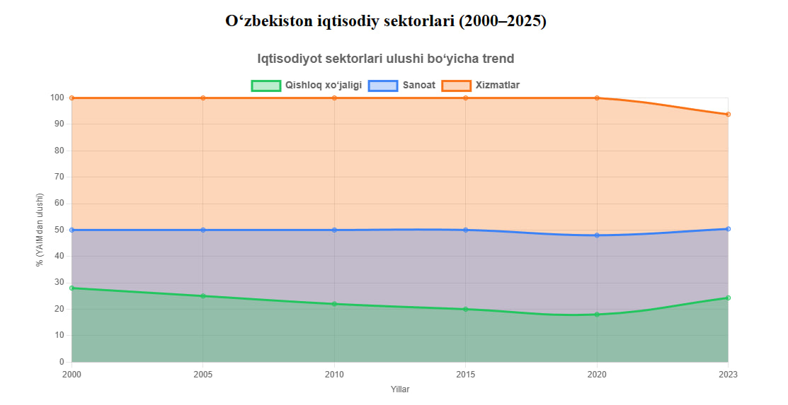
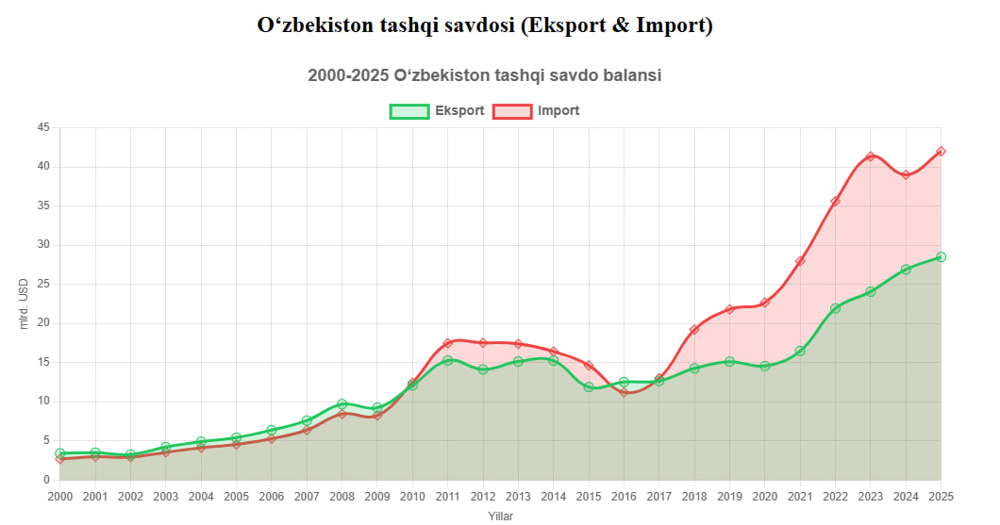

# 🏭 O‘zbekistonda Iqtisodiy Sektorlar (2000–2025)

Ushbu bo‘limda **2000–2025 yillar oralig‘ida O‘zbekiston yalpi ichki mahsulotida (YaIM) sektorlarning ulushi** (foizlarda) ko‘rsatiladi:  
- 🌾 Qishloq xo‘jaligi  
- 🏭 Sanoat  
- 🛍 Xizmatlar sohasi  

Ma’lumotlar **SQL Server** bazasida saqlanadi va **ASP.NET Core MVC + Chart.js** yordamida vizualizatsiya qilinadi.  

---

## 📊 Diagramma
Quyida **sektorlarning YaIMdagi ulushi** bo‘yicha dinamikani ko‘rishingiz mumkin:  

# 🌍 O‘zbekistonda Tashqi Savdo (2000–2025)

Ushbu bo‘limda **2000–2025 yillar oralig‘ida O‘zbekistonning eksport va import hajmi** (mlrd. AQSH dollari) bo‘yicha ma’lumotlar keltiriladi.  
Ma’lumotlar **SQL Server** bazasida saqlanadi va **ASP.NET Core MVC + Chart.js** yordamida vizualizatsiya qilinadi.  

---

## 📊 Diagramma
Quyida **eksport va import hajmining yillik dinamikasi**ni ko‘rishingiz mumkin:  

# 📉 Ishsizlik Darajasi (2000–2025)

Ushbu bo‘limda O‘zbekistonda **2000–2025 yillar oralig‘ida ishsizlik darajasi (%)** yillik kesimda tahlil qilinadi.  
Ma’lumotlar SQL Server bazasida saqlanadi va **ASP.NET Core MVC + Chart.js** yordamida vizualizatsiya qilingan.  

---

## 📊 Diagramma
Quyida **ishsizlik darajasi trendi**ni ko‘rishingiz mumkin:  

